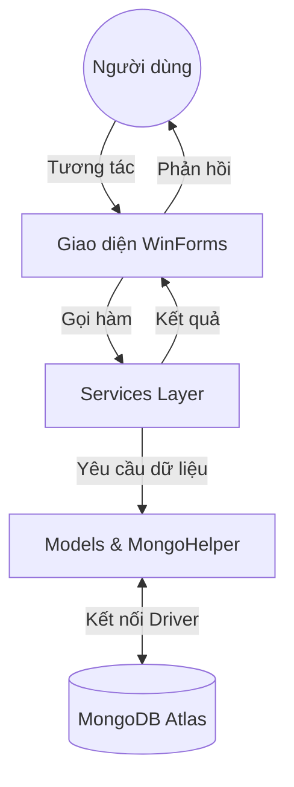

# PHẦN MỀM QUẢN LÝ HỢP ĐỒNG

> Hệ thống quản lý người dùng, khách hàng và hợp đồng chuyên nghiệp, phục vụ quy trình xử lý dữ liệu và báo cáo theo thời gian thực.

---

##  Kiến Trúc Hệ Thống (System Architecture)

Dự án được xây dựng theo mô hình **N-Tier (Đa tầng)** giúp tách biệt rõ ràng giữa giao diện, logic nghiệp vụ và dữ liệu:

1.  **Presentation Layer (Giao diện)**: 
    *   Sử dụng **Windows Forms (WinForms)** với .NET 6.
    *   Giao diện hiện đại với các thành phần tùy chỉnh (Custom Controls) từ thư viện `RJControls`.
2.  **Business Logic & Service Layer (Nghiệp vụ)**: 
    *   Quản lý các logic xử lý dữ liệu, kiểm tra quyền hạn và ghi log hoạt động thông qua các `Services`.
3.  **Data Access Layer & Models (Dữ liệu)**:
    *   Sử dụng **MongoDB (NoSQL)** làm cơ sở dữ liệu chính.
    *   Lớp `MongoHelper` quản lý kết nối và truy xuất Collection thông qua MongoDB Atlas.


## Luồng Dữ Liệu (Data Flow)



---

## Tính Năng Chính (Features)
- **Quản lý Người dùng**: Bảo mật với mã hóa AES.
- **Quản lý Hợp đồng**: Tự động hóa quá trình điền thông tin và theo dõi deadline.
- **Quản lý Khách hàng**: Lưu trữ và truy xuất nhanh chóng.
- **Thông báo Email**: Hỗ trợ khôi phục mật khẩu và thông báo quan trọng.

## Yêu Cầu Hệ Thống (Requirements)
- **.NET SDK**: [.NET 6 hoặc cao hơn](https://dotnet.microsoft.com/download/dotnet)
- **Cơ sở dữ liệu**: MongoDB (Local hoặc Atlas)
- **Thư viện chính**: `MongoDB.Driver`, `Newtonsoft.Json`.

---

## Bắt Đầu (Getting Started)

1.  **Cài đặt**: 
    ```bash
    git clone https://github.com/vinktrongle04/Environmental-Monitoring.git
    cd FinalSE
    ```
2.  **Cấu hình**: Kiểm tra chuỗi kết nối MongoDB trong `MongoHelper.cs`.
3.  **Chạy ứng dụng**: Mở file `.sln` bằng Visual Studio và nhấn F5.
